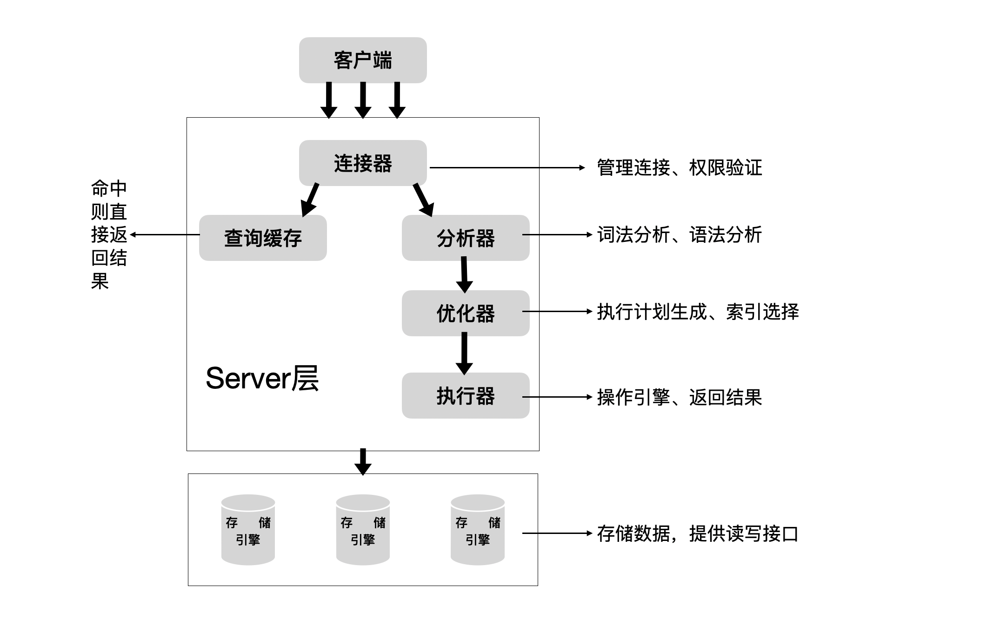

# 一条SQL查询语句是如何执行的

我们经常说，看一个事情不要直接陷入到细节里，应该先鸟瞰全貌，这样能帮你从高维度理解问题。同样，对于MySQL的学习也是这样的。比如，你有个最简单的表T，表里只有一个ID字段，在执行下面这个查询语句时：

```sql
select * from T wwhere id=1;
```

我们看到的只是输入一条语句，返回一个结果，却不知道这条语句在MySQL内部的执行过程。

所以本篇文章将MySQL拆解一下，看看MySQL内部都有哪些“零件”，希望借由这个拆解过程，让你对MySQL有更深入的理解。这样当我们碰到Mysql的一些异常或者问题时，就能够直戳本质，更为快速的定位并解决问题。

下面给出的是MySQL的基础架构示意图，从中你可以清楚的看到sql语句在MySQL中的各个功能模块的执行过程。



大体来说，Mysql的架构分为Server层和存储引擎层。

Server层包括连接器、查询缓存、分析器、优化器、执行器等，涵盖MySQL的大多数核心服务功能，以及所有的内置函数（如日期、数据、加密函数等），所有跨存储引擎的功能都在这一层实现，比如存储过程、触发器、视图等。

存储引擎层负责数据的存储和读取。其架构模式是插件式的，支持InnoDB、MyISAM、Memory等多个存储引擎。现在最常用的存储引擎是InnoDB，它从MySQL 5.5版本开始已经成了默认的存储引擎。

也就是说，如果你使用create table创建表的时候，如果不指定存储引擎，默认使用的就是InnoDB。不过你也可以指定存储引擎来使用其他的引擎。比如在create table语句中使用engine=memory，来指定使用内存引擎创建表。不同的存储引擎存取数据的方式是不同的，支持的功能也会有所不同，这个我们后面再讨论。

从图中可以看出，不同的存储引擎共用一个Server层，也就是从连接器到执行器的部分。你可以现对每个组件的名字有个印象，接下来我会结合开头的那个sql语句，分析一下完整的执行流程，和每个组件的作用。

## 连接器

第一步，你会先连接到这个数据库上，这时候接待你的就是连接器。连接器负责跟客户端建立连接、获取权限、维持和管理连接。连接命令一般是这么写的。

```bash
mysql -u$user -h$ip -p$port -p
Enter Password:
```

输入命令回车之后，你就需要在交互式对话中输入密码。虽然密码也可以直接跟在-p后面写在命令中，但这样会导致你的数据库密码泄漏，别人可以通过history命令看到你的数据库密码。如果你连接的是生成数据库，建议你不要这么做。

连接命令中的mysql是客户端工具，你可以单独安装mysql-client来使用，它是用来跟服务器建立连接的。在完成经典的TCP握手后，连接器就要开始认证你的身份，这个时候用的就是你输入的用户名和密码。

* 如果你输入的用户名密码不对，你就会收到一个 “Access denied for user”的错误，然后客户端程序执行结束。

* 如果用户名密码认证通过，连接器会到权限表里查询出你拥有的权限。之后，这个连接器里面的权限判断逻辑，都会依赖此时读到的权限。

这就意味着，如果一个用户建立连接之后，即使你使用管理员对这个用户的权限做了更改，也不会影响已经存在的连接的权限。修改完成后，只有新建的连接才会使用新的权限设置。

连接完成后，如果你没有后续的动作，这个连接就处于空闲状态，你可以在show processlist命令中看到它。

客户端如果太长时间没动静，连接器就会将它断开，这个时间是由wait_timeout 控制的，默认时间是8小时。

如果连接器被断开之后，客户端在发送请求就会收到一个错误提醒： Lost connection to MySQL server during query。 这时候如果你要继续，就需要重连，然后再执行请求了。

数据库里面，长连接是指连接成功后，如果客户端有持续请求，则一直使用同一个连接。短连接则是指每次执行完很少的几次查询就断开连接，下次查询再重新建立一个。

建立连接的过程通常是比较复杂的，所以我建议你在使用中要尽量减少建立连接的动作，也就是尽量使用长连接。

但是全部使用长连接后，你可能会发现，有些时候MySQL的占用内存涨的特别快，这是因为MySQL在执行过程中临时使用的内存是管理在连接对象里的。这些资源会在连接断开的时候才会释放，所以如果长连接积累下来，可能会导致内存占用太大，被系统强行杀掉（OOM），从现象来看，就是MySQL异常重启了。

怎么解决这个问题呢？你可以考虑以下两种方案。

1、定期断开长连接，使用一段时间，或者程序里面执行一个占用内存大的查询后，断开连接，之后要查询时再重新连接。

2、如果你用的是MySQL 5.7或者更新的版本，可以在每次执行一个较大的操作后，通过执行mysql_reset_connection 来重新初始化连接资源。这个过程不需要重连和重新做权限验证，但是会将连接恢复到刚刚创建完成时的初始状态。

## 查询缓存

连接建立完成后，你就可以执行select语句了，执行流程就会来到第二步： 查询缓存。

MySQL拿到一个查询请求后，会先在查询请求里查看，之前是不是执行过这条语句。之前执行过的查询语句及其结果可能会以key-value的形式，被直接缓存在内存中，key是查询的语句，value是查询的结果。如果你的查询能在这个缓存中找到这个key，那么mysql就会直接把对应的value返回给客户端。

如果语句不在查询缓存中，就会继续执行后面的执行流程。执行完成后，查询结果会被缓存在查询缓存中。你可以看到，如果查询命中缓存，就不需要执行后面复杂的查询操作，可以直接返回结果，这个效率很高。

**但是大多数情况下，不推荐使用查询缓存，为什么呢？因为查询缓存弊大于利。**

查询缓存的失效非常频繁，只要有对一个表的更新，这个表上所有的查询缓存都会被清空，因此很可能你费劲的把结果存起来，还没使用呢，结果就被一个更新全部清空了。对于更新压力大的数据库来说，查询缓存的命中率非常低。除非你的业务就是有一张静态表，很长时间才会更新一次。比如，一个系统配置表，那这张表上的查询才适合使用缓存。

好在Mysql也提供了这种“按需使用”的方式，你可以将参数query_cache_type 设置成DEMAAND，这样对于默认的SQL语句都不使用查询缓存。而对于你确定要使用查询缓存的语句，可以使用SQL_CACHE显式指定。像下面的语句一样：

```sql
select SQL_CACHE * from t where id=1;
```

需要注意的是，MySQL8.0直接将查询缓存的模块删除了，也就是说8.0开始彻底没有这个功能了。


## 分析器

如果查询缓存没有命中，就要开始执行真正的查询流程了。首先，MySQL需要知道你需要做什么，因此需要对SQL语句进行解析。这就是分析器做的事情。

分析器首先会对语句进行“词法分析”，你输入的是由多个字符串和空格组成的语句，Mysql需要识别出里面的字符分别是什么，代理什么。Mysql从你输入的select 识别出这是一个查询语句，他也要把字符串 “T” 识别成“表T”， 将字符串“ID” 识别成“列ID”。

做完了这些之后，就要做“语法分析”，根据词法分析的记过，Mysql会判断这个语句是否符合Mysql的语法。如果你的语句不对，你就会收到“You have an error in your SQL syntax” 的错误提醒。比如下面这个select语句少打了个s:

```sql
elect * from t where id = 10;

ERROR 1064 (42000) You have an error in your SQL syntax; check the manual that corresponds to your MySQL server version for the right syntax to use near 'elect * from t where id = 10' at line 1
```

一般语法错误会提示第一个出现错误的位置，所以你要关注的就是紧接着 “use near” 的内容。

## 优化器

经过了分析器之后，MySQL就知道你要做什么了，在开始执行之前，还需要经过优化器的处理。

优化器是在表里面有多个索引的时候，决定使用哪个索引；或者在一个多表联查的时候，决定各个表的连接顺序。比如你执行下面这个语句，这个语句是执行两个表的join：

```sql
select * from t1 join t2 using(id) where t1.c = 10 and t2.d = 20;
```

* 既可以先从表t1 取出c = 10 的记录的id值， 再根据id值关联到表t2，在判断t2里面的值是否等于20；
* 也可以先从表t2 取出c = 20 的纪录的id值，再根据id值关联到表t1，在判断t1的值是否等于10。

这两种方法的执行逻辑结果是一样的，但是执行的效率会有所不同，而优化器的作用就是选择哪一个方案。

优化器阶段完成后，这个语句的执行方案就确定了下来，然后进入执行器阶段。

## 执行器

Mysql通过分析器知道了你要做什么，通过优化器知道了该怎么做，于是就进入执行器阶段，开始真正执行语句。

开始执行的时候，会检查一下你对这个表T 有没有查询的权限，如果没有，就会返回没有权限的错误。在工程实现上，如果命中查询缓存，会在结果返回之前进行权限检查，查询也会在优化器之前调用precheck 检查权限是否正确。

```sql
mysql> select * from T where id = 10;
ERROR 1142 (42000): SELECT command denied to user 'renhj'@'localhost' for table 't'
```

如果有权限，执行器就会打开表继续执行。打开表的时候，执行器会根据表的引擎定义，去使用引擎提供的接口读写数据。

比如我们这个例子中的表T，ID字段是没有索引的，那么执行器的流程是这样的。